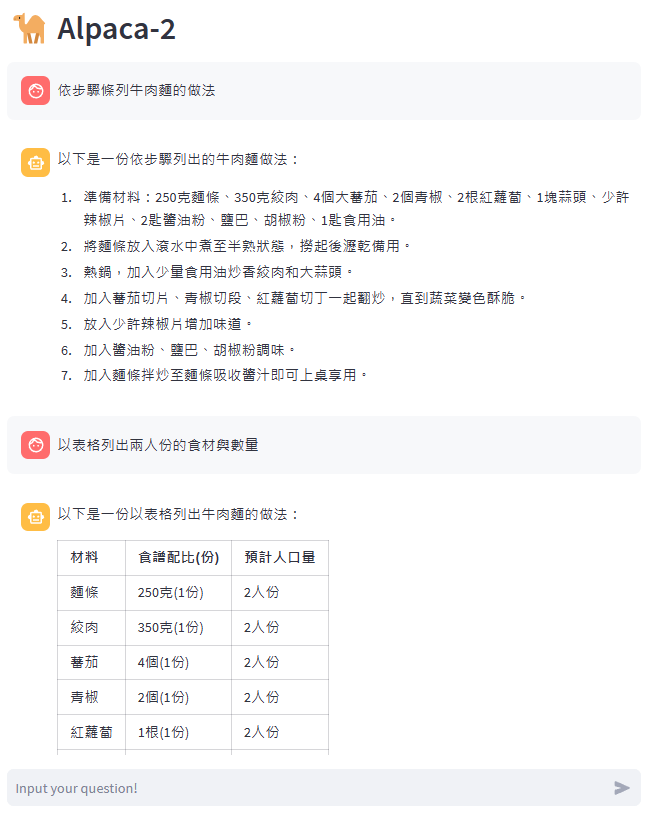
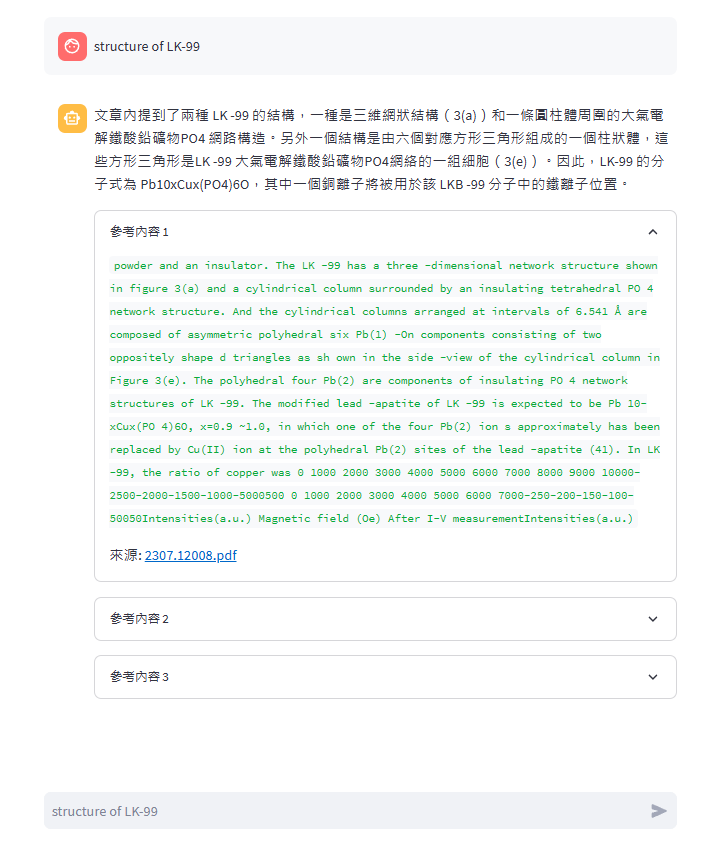

# LlamaCpp_AllUNeed

- [x] LLama QA UI
- [x] LLama Chat UI
- [x] llama.cpp GPU 環境安裝教學

## 效果演示
### Alpaca-2 Chat [文檔](Alpaca-2_Chat.md)
**此專案提供一個 Streamlit 介面，讓你可以運行 `Alpaca-2` 與模型進行對話。**


### LangChain：Retrieval QA [文檔](Retrieval_QA.md)
**LLama QA 非常適合處理大量的文檔，並根據這些文檔的內容提供即時的AI生成的答案。支援`Alpaca-2`與`OpenAI-GPT3.5`LLM模型與詞向量檢索**

  
## 系統需求: 
- UbuntuOS 22.04
- GPU版本需使用Nvidia顯示卡且`vram > 6GB`

## 安裝教學

### llama.cpp 環境建置
```
git clone https://github.com/ggerganov/llama.cpp
cd llama.cpp
make
python3 -m pip install -r requirements.txt
```

## 模型下載
[傳送門](https://huggingface.co/ziqingyang/chinese-alpaca-2-7b)
```
.
├── LlamaCpp_AllUNeed
├── chinese-alpaca-2-7b
└── llama.cpp
```

### 模型型態轉換 pth -> f16
```
python3 convert.py /path_to_model/chinese-alpaca-2-7b/
```

### 模型精度轉換 f16 -> q4
```
./quantize /path_to_model/chinese-alpaca-2-7b/ggml-model-f16.bin /path_to_model/chinese-alpaca-2-7b/gml-model-q4_0.bin q4_0
```
或是直接下載chinese-alpaca-2-7b 4bit量化模型 [GoogleDrive](https://drive.google.com/file/d/1bk2-n2fncZ8XSg_G6PIGfhZMqghfn482/view?usp=sharing)

## 套件安裝

### CPU版本
```
pip install  llama-cpp-python
```

```
pip install langchain
```

### GPU版本

#### 安裝nvcc
```
wget https://developer.download.nvidia.com/compute/cuda/12.2.0/local_installers/cuda_12.2.0_535.54.03_linux.run
sudo sh cuda_12.2.0_535.54.03_linux.run
sudo apt install nvidia-cuda-toolkit

```
#### 安裝CUBLAS
```
mkdir build
cd build
cmake .. -DLLAMA_CUBLAS=ON
cmake --build . --config Release
CMAKE_ARGS="-DLLAMA_CUBLAS=on" FORCE_CMAKE=1 pip install --upgrade --force-reinstall llama-cpp-python --no-cache-dir
```

```
pip install langchain
```

## 參考資料
- [Chinese-LLaMA-Alpaca](https://github.com/ymcui/Chinese-LLaMA-Alpaca)
- [llama.cpp](https://github.com/ggerganov/llama.cpp)
- [streamlit Chat UI](https://medium.com/@daydreamersjp/implementing-locally-hosted-llama2-chat-ui-using-streamlit-53b181651b4e)
