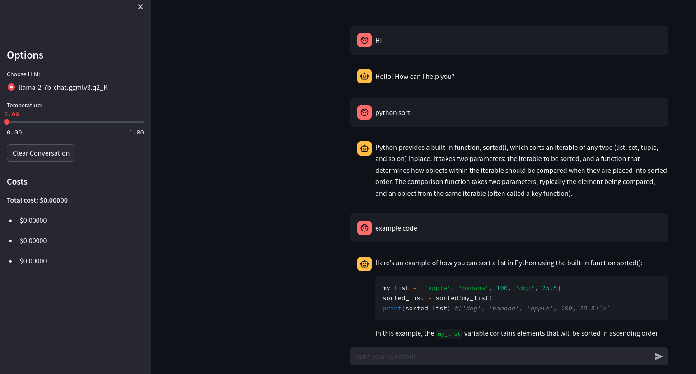

# LlamaCpp_AllUNeed

- 2023/8/1 新增qa_test.ipynb，RetrievalQA範例
- 
## 系統需求: 
UbuntuOS22.04 
- GPU版本需使用Nvidia顯示卡且vram > 6GB

## 安裝教學

### llama.cpp 環境建置
```
git clone https://github.com/ggerganov/llama.cpp
cd llama.cpp
make
python3 -m pip install -r requirements.txt
```

### 模型下載[傳送們](https://huggingface.co/ziqingyang/chinese-alpaca-2-7b)
```
.
├── LlamaCpp_AllUNeed
├── chinese-alpaca-2-7b
└── llama.cpp
```

### 模型型態轉換 pth -> f16
```
python3 convert.py /path_to_model/chinese-alpaca-2-7b/
```

### 模型精度轉換 f16 -> q4
```
./quantize /path_to_model/chinese-alpaca-2-7b/ggml-model-f16.bin /path_to_model/chinese-alpaca-2-7b/gml-model-q4_0.bin q4_0
```

## 套件安裝
### CPU版本
```
pip install  llama-cpp-python
```

```
pip install langchain
```

### GPU版本

#### 安裝nvcc
```
wget https://developer.download.nvidia.com/compute/cuda/12.2.0/local_installers/cuda_12.2.0_535.54.03_linux.run
sudo sh cuda_12.2.0_535.54.03_linux.run
sudo apt install nvidia-cuda-toolkit

```
#### 安裝CUBLAS
```
mkdir build
cd build
cmake .. -DLLAMA_CUBLAS=ON
cmake --build . --config Release
CMAKE_ARGS="-DLLAMA_CUBLAS=on" FORCE_CMAKE=1 pip install --upgrade --force-reinstall llama-cpp-python --no-cache-dir
```

```
pip install langchain
```

## 使用方法
### 依照需求修改`main.py`中的`LlamCpp`

**CPU版本**
```
llm = LlamaCpp(
    model_path="/path_to_model/chinese-alpaca-2-7b/gml-model-q4_0.bin",
    input={"temperature": 0.0, "max_length": 2048},
    callback_manager=callback_manager,
    verbose=True,
)
```

**GPU版本**
```
LlamaCpp(
        model_path="/path_to_model/chinese-alpaca-2-7b/gml-model-q4_0.bin",
        n_gpu_layers=n_gpu_layers,
        n_batch=n_batch,
        callback_manager=callback_manager,
        verbose=True,
        input={"temperature": 0.0, "max_length": 2048},
    )
```

### 啟動聊天UI
```
streamlit run main.py
```



### RetrievalQA範例
- *question : LK-99 為什麼只能提供理論上的支持*
- Docs: [南韓室溫超導體「LK-99」 美國家實驗室認證：理論上可行](https://news.ltn.com.tw/news/world/breakingnews/4382800)
- template : 使用以下上下文來回答最後的問題。如果你不知道答案，就說你不知道，不要試圖編造答案。最多使用三個句子，並儘可能保持答案簡潔。{context}問題：{question}有用的答案：

    `Llama2`
    ```
    1. 材料合成的難度很高，因此僅能提供理論上的支援。
    2. LK-99是一種超導體材質，需要在高溫和高壓下才能顯現其超導效應。目前尚未有可靠的方法可以同時控制室溫常壓下的LK-99材料的合成和處理，因此仍需進一步研究以確保實際上的運用可行性。
    3. LK-99是一種新型材料，雖然已經被證明在理論上有超導效應存在，但目前還沒有人能夠制備出符合預期條件的LK-99材質。因此，需要進一步的研究和努力才能確定其實際運用可行性。
    4. 現階段對於LK-99材料的合成方法仍然了解不多，所以仍需進行更多的研究和探究以找出有效的合成方法。'
    ```
    
    `OpenAI`
    ```
    LK-99只能提供理論上的支持，因為它的合成和排列需要非常特殊的條件和位置，並且只有很小一部分晶體能夠實現這種排列。這使得LK-99的合成和重現變得非常困難。
    ```

ref:
- [Chinese-LLaMA-Alpaca](https://github.com/ymcui/Chinese-LLaMA-Alpaca)
- [llama.cpp](https://github.com/ggerganov/llama.cpp)
- [streamlit Chat UI](https://medium.com/@daydreamersjp/implementing-locally-hosted-llama2-chat-ui-using-streamlit-53b181651b4e)
