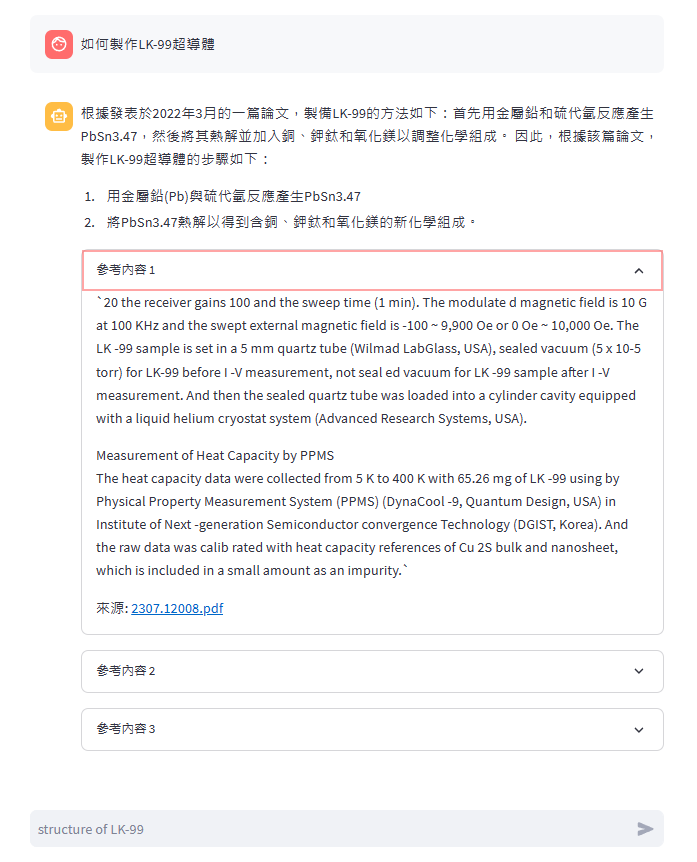

# LlamaCpp_AllUNeed
Road Map
- [x] 支持 Docker 環境
- [ ] Alpaca-2: Text summary
- [x] Alpaca-2: Retrieval QA
- [x] Alpaca-2: Chat

## 效果演示
### Alpaca-2: Chat
#### 此專案提供一個 Streamlit 介面，讓你可以運行 `Alpaca-2` 與模型進行對話。


### Alpaca-2: Retrieval QA
#### Alpaca-2: Retrieval QA 的一個完美用例是用戶擁有大量的PDF文件，並在這些文檔中尋找特定的信息。而不是手動閱讀所有文件，用戶可以簡單地問AI獲取信息。AI將處理文檔，找到相關的信息，並提供簡潔的回答，所有這些都只需要幾秒鐘。

  
## 系統需求: 
- UbuntuOS 22.04
- GPU版本需使用Nvidia顯示卡且`vram >= 8GB`

## 使用 docker 啟動

### 1. 建立 Docker 映像
這個命令會使用當前目錄下的Dockerfile來建立一個新的Docker映像並命名為alpaca-chat。
```
docker build -t alpaca-chat .
```

### 2. 由Docker啟動範例

<details><summary>這個命令會運行一個新的Docker容器：</summary>
<p>
  
- `-d`: 在後台運行容器。
- `-it`: 以互動模式運行容器，並保持打開的終端。
- `--gpus all`: 使用主機上的所有GPU。
- `-p` 8501:850': 將容器的8501端口映射到主機的8501端口。
- `--name` alpaca-chat: 將容器命名為alpaca-chat。
- `alpaca-chat`: 使用alpaca-chat映像來運行容器。
- `sh`: 啟動容器時運行的命令。
  
</p>
</details>

```
docker run -d -it --gpus all -p 8501:8501 --name alpaca-chat alpaca-chat sh
```

### 3. (可選)使用參數`-v`設定共享`docs`資料夾
```
docker run -d -it --gpus all -p 8501:8501 -v PATH/TO/docs:/LlamaCpp_AllUNeed/docs --name alpaca-chat alpaca-chat sh
```

### 4. 進入 Docker 容器的終端
```
docker exec -it alpaca-chat sh
```

**啟動 Alpaca-2: Chat** [文檔](Alpaca-2_Chat.md)
```
streamlit run chat.py
```


**啟動 Alpaca-2: Retrieval QA** [文檔](Retrieval_QA.md)
```
streamlit run qa.py
```


## 由本地環境建置(不推薦)

### 模型下載
#### 直接下載chinese-alpaca-2-7b 4bit量化模型 [GoogleDrive](https://drive.google.com/file/d/1bk2-n2fncZ8XSg_G6PIGfhZMqghfn482/view?usp=sharing)
```
└─LlamaCpp_AllUNeed
    ├─chinese-alpaca-2-7b
    │    └─ggml-model-q4_0.bin
    ├─docs
    └─faiss
```

#### 使用官方模型自己轉換型態(不推薦)
模型下載[傳送門](https://huggingface.co/ziqingyang/chinese-alpaca-2-7b)
#### llama.cpp 環境建置
```
git clone https://github.com/ggerganov/llama.cpp
cd llama.cpp
make
python3 -m pip install -r requirements.txt
```
模型型態轉換 pth -> f16
```
python3 convert.py /path_to_model/chinese-alpaca-2-7b/
```

模型精度轉換 f16 -> q4
```
./quantize /path_to_model/chinese-alpaca-2-7b/ggml-model-f16.bin /path_to_model/chinese-alpaca-2-7b/gml-model-q4_0.bin q4_0
```

### 套件安裝

```
pip install -r requirement.txt
```

#### CPU版本

```
pip install  llama-cpp-python
```

#### GPU版本

安裝nvcc
```
wget https://developer.download.nvidia.com/compute/cuda/12.2.0/local_installers/cuda_12.2.0_535.54.03_linux.run
sudo sh cuda_12.2.0_535.54.03_linux.run
sudo apt install nvidia-cuda-toolkit

```
安裝CUBLAS
```
mkdir build
cd build
cmake .. -DLLAMA_CUBLAS=ON
cmake --build . --config Release
CMAKE_ARGS="-DLLAMA_CUBLAS=on" FORCE_CMAKE=1 pip install --upgrade --force-reinstall llama-cpp-python --no-cache-dir
```


## 參考資料
- [Chinese-LLaMA-Alpaca](https://github.com/ymcui/Chinese-LLaMA-Alpaca)
- [llama.cpp](https://github.com/ggerganov/llama.cpp)
- [streamlit Chat UI](https://medium.com/@daydreamersjp/implementing-locally-hosted-llama2-chat-ui-using-streamlit-53b181651b4e)
