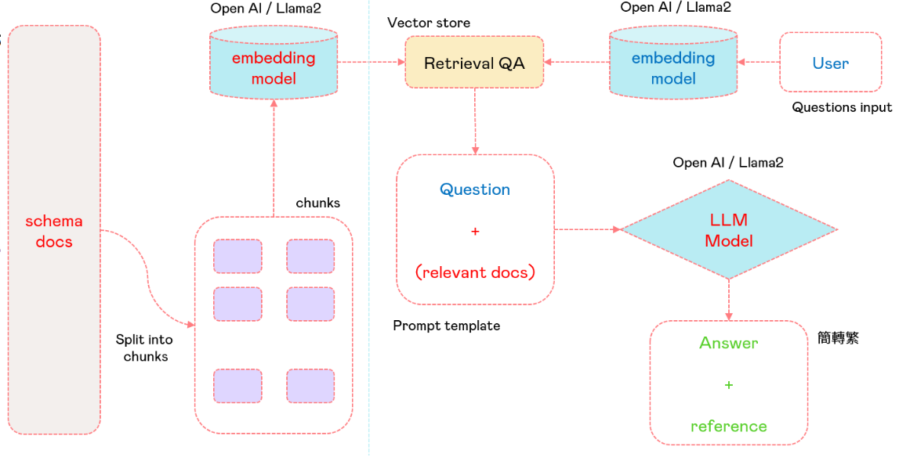

# Alpaca-2：Retrieval QA
Alpaca-2 ：Retrieval QA 的一個完美用例是用戶擁有大量的PDF文件，並在這些文檔中尋找特定的信息。而不是手動閱讀所有文件，用戶可以簡單地問AI獲取信息。AI將處理文檔，找到相關的信息，並提供簡潔的回答，所有這些都只需要幾秒鐘。
## 如何使用

⚠️ **注意: 選用openai model或embedding 需添加環境變數 `export OPENAI_API_KEY=`**

⚠️ **注意: `LLama`詞向量檢索不夠精準，實際使用建議使用`openai`**



### 詞向量處理
將PDF切成chunk建立詞向量並儲存，用於日後檢索使用，如有第一次使用或新增PDF文件時執行。

```bash
python3 emb.py --embedding openai
```

- `embedding`：選擇要使用的嵌入（默認：'llama'）。選項：'llama'或'openai'。

結束後將會儲存`faiss/openai_index`或是`faiss/llama_index`

### 啟動 Retrieval QA
```bash
streamlit run qa.py -- --model openai  --embedding openai --hyperlink <bool>
```

- `model`：指定用於處理的模型（默認：'llama'）。選項：'llama'或'openai'。
- `model-path`：指定模型文件的完整路徑。(使用openai model可略過)
- `embedding`：選擇要使用的詞向量（默認：'llama'）。選項：'llama'或'openai'。
- `hyperlink`：是否在處理的PDF中包含超鏈接（默認：False）。使用'True'啟用超鏈接。
  <details><summary>hyperlink 小工具</summary>
  <p>

  **qa.py** 修改ip位置
  ```python
  st.write(f'來源: [{name}](http://0.0.0.0:8502/pdf/{basename})')
  ```
  **pdf.py** 利用Fastapi將PDF在指定網址中顯示，自行更改所需`port`與`path`
  ```python
  import os
  import uvicorn
  import argparse
  from fastapi import FastAPI
  from fastapi.staticfiles import StaticFiles
  # Create the parser
  path = os.path.join(os.getcwd(),'docs')
  app = FastAPI()
  # Mount static file directory
  app.mount("/pdf", StaticFiles(directory=path), name="pdf")
  uvicorn.run(app, host="0.0.0.0", port=8502)
  ```
  </p>
  </details>
